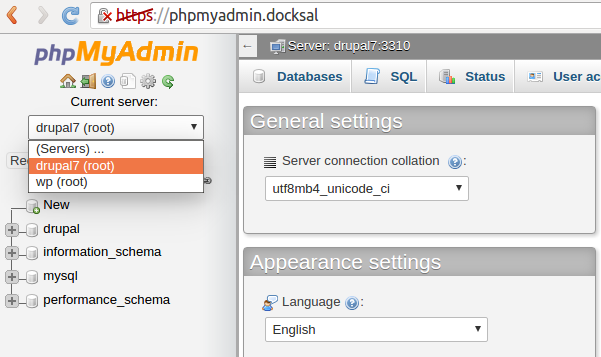

# Docksal phpMyAdmin

This is phpMyAdmin installation. You can use it for investigate you databases on the Docksal environment.
It uses [phpMyAdmin Version 4.6.4](https://www.phpmyadmin.net/)

## Setup instructions

### Step #1: Docksal environment setup

**This is a one time setup - skip this if you already have a working Docksal environment.**  

Follow [Docksal environment setup instructions](https://github.com/docksal/docksal/blob/develop/docs/env-setup.md)
   
### Step #2: phpMyAdmin setup

1. Clone this repo into your Projects directory

    ```
    git clone https://github.com/docksal/phpmyadmin.git
    cd phpmyadmin
    ```

2. Start project services

    This creates containers for phpMyAdmin

    ```
    fin up
    ```

3. Config phpMyAdmin servers

   You need to bind you project container ports to the host.

   For example [Drupal 7 project](https://github.com/docksal/drupal7) docker-compose.yml file contains:

   ```
      # DB node
      db:
        extends:
          file: .docksal/docksal-services.yml
          service: db
   ```
   You have to add binding for MySql port:
      ```
         # DB node
         db:
           extends:
             file: .docksal/docksal-services.yml
             service: db
           ports:
             - "3310:3306"
      ```
   It can be any other port: "3311:3306", "3306:3306", etc. You have to use different ports for different projects.

   Now you can add this Drupal 7 MySql server to your phpMyAdmin **config.inc.php** (it is in root directory of phpmyadmin project).
   This file already contains two examples servers. Please delete them and add your own:
   ```
     /**
      * Server #1
      */
     $i++;
     $cfg['Servers'][$i]['verbose'] = 'drupal7';    // Name to show when selecting your server on phpMyAdmin
     $cfg['Servers'][$i]['port'] = '3310';          // Local port for your MySql
     $cfg['Servers'][$i]['user'] = 'root';          // root user for MySql
     $cfg['Servers'][$i]['password'] = 'admin123';  // password for root user
   ```

   Password for root user can be find in docker-compose.yml or in .docksal/docksal-services.yml for your project - for example please see [docksal-services.yml](https://github.com/docksal/drupal7/blob/master/.docksal/docksal-services.yml):
   ```
     # DB node
     db:
       hostname: db
       image: docksal/mysql:5.5
       environment:
         - MYSQL_ROOT_PASSWORD=admin123
         - MYSQL_USER=drupal
         - MYSQL_PASSWORD=123
         - MYSQL_DATABASE=drupal
   ```

4. Point your browser to

    ```
    http://phpmyadmin.docksal
    ```

    If you specify more than one server, you can change them from phpMyAdmin:

    


    In some cases you have to add this domain to your hosts file

    ```
      192.168.10.10	phpmyadmin.docksal
    ```